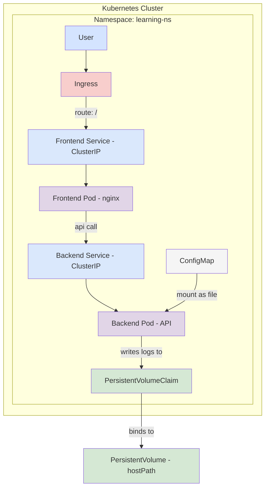

id: task-1
title: "Scaffold beginner Kubernetes manifests"
status: "In Progress"
created: 2025-07-30
updated: 2025-07-30

## Description

Set up the repository structure and raw YAML manifests for a beginner-friendly **two-tier Kubernetes project** (manual branch, `kubectl apply` workflow). This provides a richer learning experience by demonstrating service-to-service communication, configuration management, and practical persistent storage.

The project includes:

- **Frontend**: An `nginx` container serving a static HTML/JS page for the clock and timezone UI.
- **Backend**: A simple API (Python/Node.js) providing time and timezone calculation logic.

### Architecture Diagram

_alt-text: A diagram showing a user connecting to an Ingress, which routes to a frontend Nginx service. The frontend service communicates with a backend API service. The backend pod is configured by a ConfigMap and writes logs to a Persistent Volume Claim._

## Acceptance Criteria

- [ ] Branch `manual` exists and contains `/manifests` directory.
- [ ] `namespace.yaml` defines namespace `learning-ns`.
- [ ] **Frontend:** `deployment-fe.yaml` and `service-fe.yaml` are created for the nginx frontend.
- [ ] **Backend:** `deployment-be.yaml` and `service-be.yaml` are created for the time-logic API backend.
- [ ] **ConfigMap:** `configmap-be.yaml` provides configuration to the backend (e.g., default timezone).
- [ ] **Storage:** `pv-pvc.yaml` provides a volume for the backend to store log files.
- [ ] `ingress.yaml` routes `/` to the frontend service.
- [ ] Frontend successfully makes API calls to the backend service.
- [ ] All manifests validate with `kubectl apply --dry-run=server`.
- [ ] README documents the two-tier architecture and the `kubectl apply` workflow.
- [ ] Deployed application UI displays a clock and can calculate timezone differences via the backend API.

## Session History

- 2025-07-30 16:07: Agent switched to code mode and started implementation.

## Decisions Made

- **Adopt a Two-Tier Architecture**: Separating the frontend (UI) and backend (logic) into distinct services provides a more realistic and instructive model than a single application. It allows for independent scaling and demonstrates service-to-service communication.
- **Use ConfigMap for Backend Configuration**: Decouples configuration from the container image, allowing for easier management of settings like default timezones.
- **Use PersistentVolume for Logs**: Provides a practical, real-world use case for persistent storage, demonstrating how a stateful component (in this case, log files) can be managed.

## Files Modified

<!-- Track all file changes -->

## Blockers

<!-- Document any blockers encountered -->

## Next Steps

<!-- Maintain continuity between sessions -->
