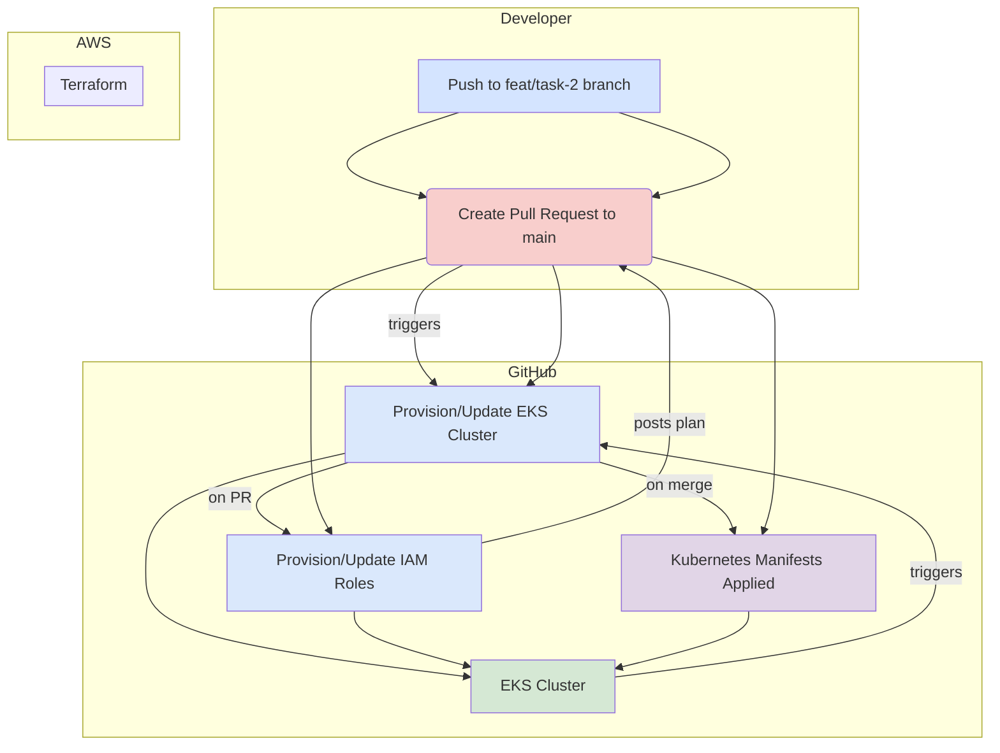

id: task-2
title: "Automate AWS EKS Deployment with Terraform and GitHub Actions"
status: "To Do"
depends_on: ["task-1"]
created: 2025-07-30
updated: 2025-07-30

## Description

This task involves creating a full CI/CD pipeline to automate the deployment of the two-tier web application to a production-grade environment on **Amazon Web Services (AWS)** using a safe, pull-request-based Git workflow.

We will use **Terraform** to define and provision the necessary cloud infrastructure (EKS cluster). A **GitHub Actions** workflow will be triggered on pull requests to `main`, allowing for infrastructure plans to be reviewed before being applied upon merge.

### Architecture Diagram

_alt-text: A diagram showing the CI/CD flow. A git push triggers a GitHub Action. The action runs Terraform to create an EKS cluster and IAM roles in AWS. Finally, the action applies Kubernetes manifests to the newly provisioned EKS cluster._

## Acceptance Criteria

- [ ] A new `terraform/` directory contains all Terraform configuration files.
- [ ] Terraform code defines an EKS cluster.
- [ ] Terraform code defines the necessary IAM roles for the cluster and for GitHub Actions to assume.
- [ ] A new feature branch (e.g., `feat/task-2-aws-automation`) is used for all development.
- [ ] A GitHub Actions workflow is defined in `.github/workflows/deploy.yml`.
- [ ] The workflow is triggered on `pull_request` events targeting the `main` branch.
- [ ] On pull request creation/update, the workflow runs `terraform plan` and posts the output as a PR comment.
- [ ] On pull request merge to `main`, the workflow runs `terraform apply` to provision the infrastructure.
- [ ] The workflow securely authenticates to AWS using OIDC or stored secrets.
- [ ] After a successful `terraform apply`, the workflow configures `kubectl` and applies the manifests from the `manifests/` directory to the EKS cluster.
- [ ] The `README.md` is updated to explain the new automated deployment process.

## Session History

<!-- Update as work progresses -->

## Decisions Made

<!-- Document key implementation decisions -->

## Files Modified

<!-- Track all file changes -->

## Blockers

<!-- Document any blockers encountered -->

## Next Steps

<!-- Maintain continuity between sessions -->
